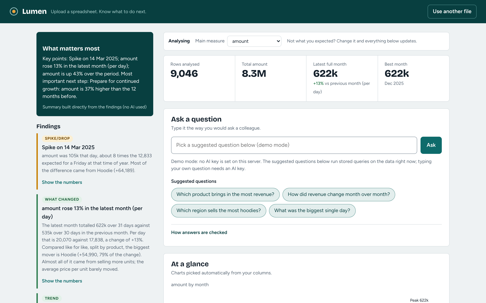
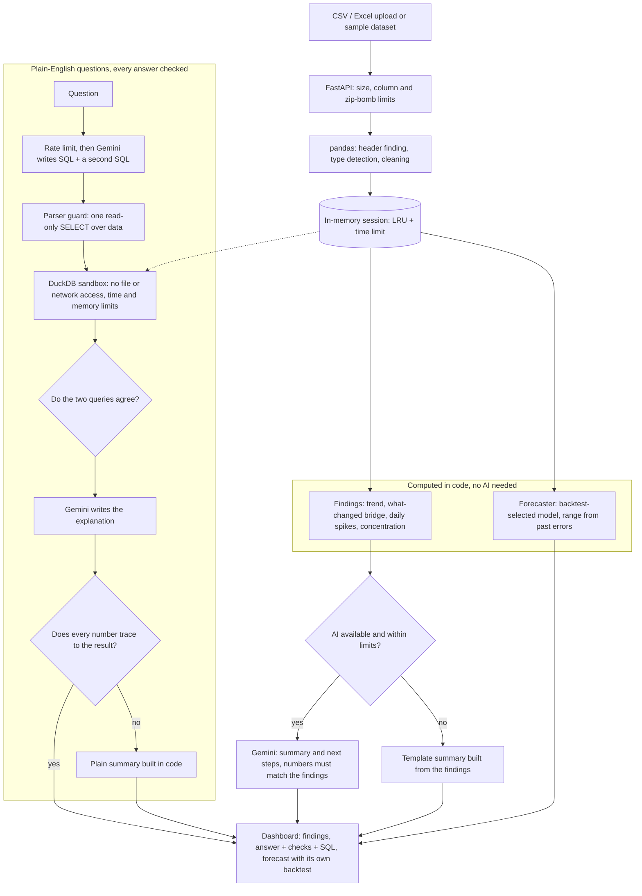

# Lumen: free, open-source AI analytics for people without an analyst

**ForgeHacks 2026, track AI + Business.** The prompt: *"Build an AI-powered solution that turns business data into clear insights, predictions, or recommendations that help people make better decisions."*

Upload a CSV or Excel file. Lumen cleans it, tells you what matters before you ask, answers questions in plain English, forecasts the next few periods, and suggests next steps. For every answer it shows how it was checked.

**Live demo:** LIVE_URL_PLACEHOLDER  |  **Demo video:** VIDEO_URL_PLACEHOLDER  |  **License:** MIT



## The problem

Small shops, NGOs and student organisations collect sales, donations, stock and expense data, but rarely turn it into decisions. Power BI and Tableau are paid tools that need training. Power BI's Copilot needs paid capacity. General chatbots can read a CSV, but they give an answer with no standing way to check it. The people who most need clear answers (a shop owner, an NGO coordinator, a club treasurer) are left with a spreadsheet they cannot interpret.

## What Lumen does

| You get | How it is produced |
|---|---|
| **Automatic cleaning and a starter dashboard** | pandas: finds the real header row (title rows, TOTAL rows, several sheets), detects dates, numbers, currencies, European formats and encodings, removes empty rows and columns and makes column names unique. A raw-vs-cleaned preview shows exactly what changed. |
| **Insights before you ask** | Computed in code, not by the AI: trend, spikes and drops (with the segment that caused them), data-quality warnings, concentration risk, and which group is different (a segment moving against the total, a group with an unusual paid-of-due or no-show ratio, the lowest-scoring group in a survey). Months with different amounts of data are compared per day or per reporting date, so a longer month is not mistaken for growth. An "unusual values" finding opens into the actual largest records so you can check each against your source. |
| **"What changed and why"** | The change between two equal periods is split into exact per-segment contributions that add up to the total change (checked in code), and into volume versus price when units are present. |
| **Plain-English questions** | Gemini writes a read-only SQL query. Lumen runs it in a sandbox and checks the result (see below). You can always open the SQL and the rows. |
| **Forecasts that are tested first** | The method is chosen by backtesting on your own history (naive, seasonal, smoothing and Theta models and their averages). The range comes from that model's own past errors. Lumen reports how it did against a simple repeat-the-last-value guess in those tests, uses simple methods on short histories, and declines when there is too little history. |
| **Recommended next steps** | Built by rules in code from the findings, each with a "because" line quoting the evidence (for example the donors who gave before and went quiet, or the status that is owed money). Same output with or without an AI key. |
| **Data health and a measure picker** | Lumen tells you what it cleaned (total rows removed, spellings merged, out-of-range scores ignored). If it guessed the wrong measure or date column, you can pick another and everything recomputes. |
| **Works without AI** | Everything except free-text questions runs with no API key. Sample questions on the built-in datasets still work, using stored queries run live on the data. |

## How answers are checked

The model is never trusted with a number.

1. **SQL is parsed, not pattern-matched.** DuckDB's own parser must see exactly one `SELECT` over the table `data` (and its own CTEs). Any table function, file read, `PRAGMA`, `SET`, `COPY` and so on is rejected wherever it appears. An earlier keyword blocklist was bypassed by building a blocked word at run time (`query(replace(...))`); the structural check is not affected by that trick (`tests/test_sqlguard.py`, 75 cases).
2. **It runs in a sandbox.** In-memory DuckDB, file and network access off, configuration locked, 2 threads, 512 MB memory limit, 10 second interrupt, 1,000-row cap.
3. **A second, differently written query must agree.** The model writes the query two ways. If the values differ, the answer is flagged "check this one".
4. **Every number in the explanation must trace to the result**: a cell, or a sum, share, difference or percentage change computed from cells, to the precision shown. The same goes for names: if the explanation names a product, donor or region from your data that is not in the result, the wording is thrown away too. In both cases a plain summary built in code is shown instead.
5. **Everything is visible**: the checks that passed or failed, the SQL, the second query and the result rows.

These checks catch many mistakes but not all. Two queries can share the same misunderstanding of the question, so read the SQL if the decision matters.

## Architecture

(Also as an image: [`docs/architecture.png`](docs/architecture.png).)



## Evidence

Everything below is reproducible from this repository.

- **Tests:** `python -m pytest -q` runs 265 tests: the SQL attack suite, the fake-Gemini failure paths (quota, retired model, blocked reply, bad JSON, bad key, disagreeing queries, made-up numbers), the HTTP API end to end, the analytics and an ingestion regression suite of 40+ messy real-world-style files, and regression tests from a black-box review (17 unseen datasets with planted facts) covering total rows, spelling variants, measure choice, rating codes and like-for-like month comparisons.
- **Spike detector** (`python -m evals.bench_anomaly`): on pure-noise series, false alarms in 4 of 150 (2.7%). A planted spike of 5 times a normal day or more is found 60 of 60 times; 3 times, 27%; 2 times, about 2%. Daily revenue from a handful of orders is noisy, so small spikes are not flagged. That is by design.
- **Forecaster** (`python -m evals.bench_forecast`): on 90 synthetic monthly, weekly and daily series with the last 6 periods held out, the forecaster is about as accurate as plain Holt-Winters (median MASE 0.820 against 0.812, where 1.0 is a seasonal-naive forecast and lower is better), and beats a repeat-the-last-value guess on 73% of series. Its 95% range contained the true value 93.7% of the time (Holt-Winters: 95.2%). The point is not extra accuracy: it chooses its method by testing, reports that test, and declines when history is too thin. We also tried a high/medium/low self-rating; it did not predict accuracy in this test, so Lumen does not show one.
- **Plain-English question accuracy** (`GEMINI_API_KEY=... python -m evals.run_eval`): 20 questions on the sample shop data, each scored against an answer computed independently in pandas; the harness also reports how many wrong answers Lumen's checks flagged. The benchmark itself is tested: every reference query reproduces the pandas answer (`tests/test_evals.py`). **Measured on 10 Oct 2026: 20/20 correct**, median 5.4 s per question ([`evals/results/latest.md`](evals/results/latest.md)). 17 were marked fully checked and 3 correct answers were marked for review: two as "partly checked" (one check could not confirm them) and one as "disagree": in that one ("biggest single order"), 1,125 orders tie for the largest amount and the two queries returned different tied rows. Run the command with your own key to reproduce it. Gemini's output varies, so results can differ slightly from run to run.
- **Memory:** measured on the real server with the pinned dependencies: 147 MB idle, 314 MB peak after loading all three samples, forecasting each and uploading a 4.9 MB, 185,000-row file. That fits a 512 MB free host.

## Privacy and honest limits

- Your file is held **in memory** on the server and is not stored by Lumen. (Very large uploads may be spooled to a temporary file by the web framework while being read.) Sessions expire after 30 minutes of inactivity.
- **When AI is on, Google's Gemini receives** your column names, a few sample values, your question, the SQL and the results or findings needed to answer. On Google's free tier, prompts may be used to improve Google's products. **Do not upload sensitive data to a shared demo.** To keep everything on your machine, self-host and leave `GEMINI_API_KEY` unset: all analysis, forecasting and the sample questions still work.
- The hosted demo accepts files up to 5 MB and rate-limits questions so a free AI quota lasts. When the AI is unavailable, stored sample questions still answer.
- Forecasts are estimates. With short history Lumen says so, and uses simple methods that backtest better than complex ones.
- The AI can still misread a question. The checks reduce that risk; they do not remove it.
- The name check only knows labels that exist in your data and only compares them with the result: it cannot catch a wrong claim that uses no label ("sales are healthy"). The result table is always shown beside the explanation for that reason.
- Wide pivot-style files (one column per month), files that record debits and credits in separate columns, and periods written as text ("Q1 FY25") are read as ordinary columns, not as time series. Reshape them to one row per record for the best results.
- Lumen picks a main measure and date column automatically; when it guesses wrong, use the picker above the dashboard.
- Dates like `03/04/2025` are read day-first unless the file shows otherwise (set `AMBIGUOUS_DAYFIRST = False` in `app/analytics.py` for US-only data).

## How it compares

Power BI and Tableau are powerful and have forecasting, but are paid and take training; Power BI's Copilot requires paid capacity. ChatGPT, Claude and Gemini have free tiers that can analyse a CSV, but they are general chat tools: you must know what to ask, and an answer comes without a standing check. Lumen is narrower on purpose: free and open source, **insight-first** (it tells you what matters before you ask), every answer shows its checks, forecasts report their own backtest, and it can run entirely on your own machine without an AI key.

## Run it

```bash
python -m venv .venv && source .venv/bin/activate        # Windows: .venv\Scripts\activate
pip install -r requirements.txt                          # Python 3.12+; developed on 3.13
cp .env.example .env                                     # optional: add a free key from https://aistudio.google.com
uvicorn app.main:app --reload                            # open http://localhost:8000
```

Click a sample dataset (campus shop, NGO donations, warehouse inventory) for an instant tour. Without a key, free-text questions are off and the sample questions use stored queries.

```bash
pip install -r requirements-dev.txt && python -m pytest -q          # tests (no network, no key needed)
docker build -t lumen . && docker run -p 8000:8000 -e GEMINI_API_KEY=... lumen
```

### Deploy on Render (free)

New, Web Service, pick this repo, Runtime Docker, Instance Type Free. Add the environment variables `GEMINI_API_KEY` (secret), `LUMEN_MAX_UPLOAD_MB=5`, `LUMEN_MAX_CELLS=3000000`, `LUMEN_TRUST_PROXY=1`; set the health check path to `/api/health`. (`render.yaml` describes the same setup.) Free instances sleep when idle, so the first visit after a pause takes about a minute.

Limits are environment variables: `LUMEN_MAX_UPLOAD_MB`, `LUMEN_MAX_ROWS`, `LUMEN_MAX_COLS`, `LUMEN_MAX_SESSIONS`, `LUMEN_MAX_CELLS`, `LUMEN_SESSION_TTL_S`, `LUMEN_ASK_PER_10MIN`, `LUMEN_ASK_PER_DAY`, `LUMEN_ASK_GLOBAL_PER_DAY`, `LUMEN_FORECAST_PER_10MIN`, `LUMEN_FORECAST_GLOBAL_PER_DAY`, `GEMINI_MODEL`.

## Project layout

```
app/main.py         HTTP API, limits, headers, demo-mode fallback
app/analytics.py    ingestion, profiling, insights, starter charts
app/drivers.py      what-changed bridge, daily spike detection
app/forecasting.py  backtest-selected forecaster
app/llm.py          Gemini client, answer checks, number grounding, narrative
app/sqlguard.py     SQL parser guard and DuckDB sandbox
app/limits.py       session store, rate limiter, upload checks
app/samples.py      sample datasets and stored questions
static/             single-page UI (Plotly and fonts are bundled; no third-party requests)
tests/  evals/      tests, benchmarks, live accuracy evaluation
```

## Built during the hackathon

| Date (2026) | What |
|---|---|
| Oct 8 | First version: upload, profiling, starter dashboard, Gemini question-to-SQL in a sandbox, statistical insights, Holt-Winters forecast, recommendations (Eshaan Sumesh). |
| Oct 9 | Preprocessing preview (raw vs cleaned), multi-model fail-over for busy servers. |
| Oct 9 to 10 | Security review and rebuild of the SQL guard; ingestion fixes from a 69-file QA battery; backtest-selected forecaster; what-changed and spike analysis; checked answers and number grounding; keyless demo mode; NGO and inventory samples; rate limits; local Plotly and fonts; tests and benchmarks; deployment. |

## Team and AI assistance

ForgeHacks team: Eshaan Sumesh, Anhad Mahajan, Aman Saxena, Harsh Salunkhe.

Built with AI coding assistance (Claude), as permitted by the ForgeHacks rules. The AI features inside Lumen use the Google Gemini API.

## License

MIT, see `LICENSE`. Plotly.js (MIT) and the Figtree, Fraunces and Geist Mono fonts (SIL OFL 1.1) are bundled under `static/vendor`.
