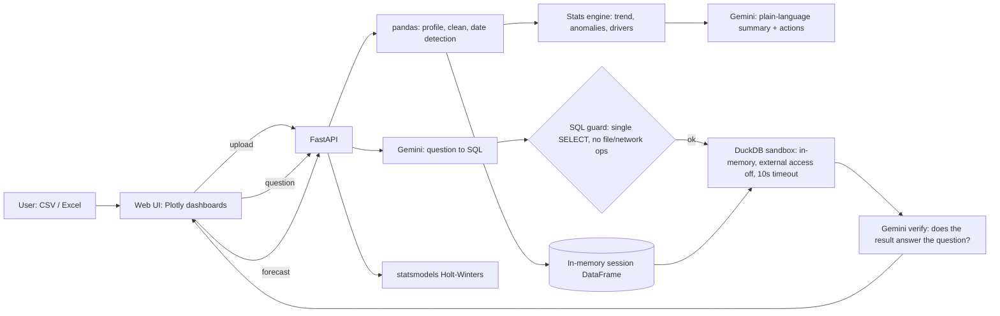

# Lumen: free, open-source AI analytics for people without an analyst

Upload a CSV or Excel file. Lumen profiles it, surfaces what matters, answers questions in plain English,
forecasts, and recommends next steps. It is **insight-first**: it tells you what's important before you ask.

Built for small businesses, NGOs and student organizations that have data but no data analyst, and can't pay for Power BI or Tableau.

## Features
| Feature | How it works |
|---|---|
| Auto profiling + starter dashboard | pandas: column types, missing values, outliers (IQR), date detection, auto charts |
| Plain-English questions | Gemini writes one DuckDB `SELECT`; it is validated and run in a locked-down sandbox |
| Automated insights | Statistics, not LLM guesses: trend (first vs last third), anomalies (robust z-score on MAD), drivers (share of total, correlation) |
| Forecasting | statsmodels Holt-Winters (damped trend, seasonal when 2+ cycles), 95% range |
| Recommendations | Gemini phrases the next steps, grounded only in the computed findings; template fallback without a key |

## Architecture


### Safety and trust
1. **No arbitrary code.** The AI writes SQL, not Python. A guard allows exactly one `SELECT`/`WITH` and blocks write, file, network and config operations.
2. **Sandbox.** DuckDB runs in memory with `enable_external_access=false`, a locked configuration, a 1,000-row cap and a 10-second timeout.
3. **Self-repair.** If the SQL errors, the model gets the error and retries once.
4. **Verification.** A second pass checks the result answers the question and writes the explanation using only numbers in the result. The UI shows the SQL and raw rows so the user can check.
5. **Privacy.** Files live in memory only and are never written to disk. Self-host to keep data fully on your machine. Only the schema, 3 sample values per column and the query result rows go to Gemini.

## Run locally
```bash
python -m venv .venv && source .venv/bin/activate
pip install -r requirements.txt
cp .env.example .env            # add your free key from aistudio.google.com
export $(grep -v '^#' .env | xargs)
uvicorn app.main:app --reload   # open http://localhost:8000
```
Without a key everything works except the question box. Click **Try sample shop data** for an instant demo.

## Deploy (for the required deployment link)
- **Render / Railway:** new Web Service from this repo, Docker runtime, add `GEMINI_API_KEY`.
- **Hugging Face Spaces:** Docker Space, set `app_port: 8000` in the Space README header, add the key as a secret.

## Known limits
- Monthly insights hide single-day spikes; add a daily anomaly check.
- Sessions are in memory (restart = re-upload); the SQL blocklist is conservative and can reject a column named `set` or `load`.
- Forecasts need at least 8 periods of history.

## Roadmap
Multi-table joins, Prophet option, saved dashboards, PDF/email weekly report, multilingual questions.

## License
MIT
